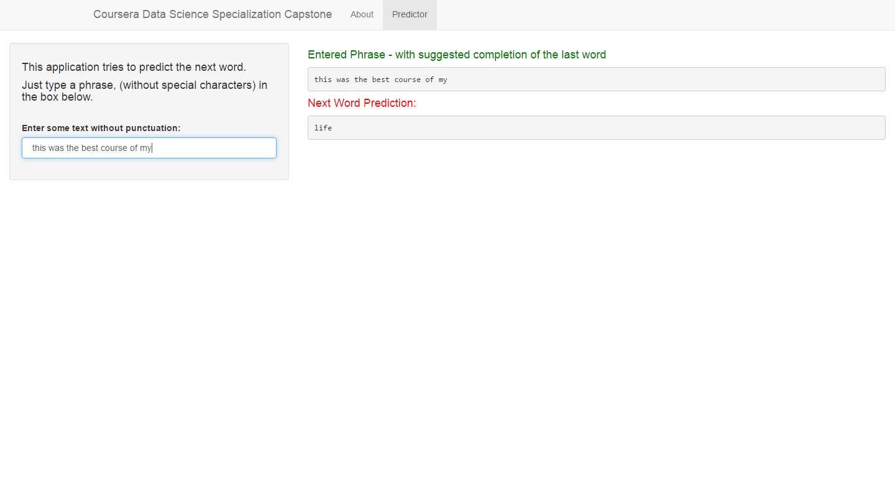

Capstone Presentation
========================================================
author: Paulo Cardoso
date: May, 2016
autosize: true

Introduction
========================================================

The Coursera & Johns Hopkins University's  Data Science Specialization's Capstone project was created in partnership with a leading tech company - SwiftKey and is available through Coursera. 

The objective of this project is to apply skills and knowledge aquired from the entire specialization and build a predective model based on **Natural Language Processing**.

The data used in the model is part of a corpus [HC Corpora] (www.corpora.heliohost.org) which is a body of blogs, news and tweets in multiple languages. But on this project only English data was used.

Model
========================================================

In the development of this model the following stand out:
- N-Gram technique.
- Training subset compose a sample of 20% of the amount of data.
- Training based on Maximum Likelihood
- Filter on profane words

Web App - Shiny
========================================================

This is the Shiny app developed as part of Capstone and is availabe [here](https://cardosop.shinyapps.io/en_US/). And is composed of two tabs "About" and "Predictor". 
- About: contain a brief description of the app and the project.
- Predictor: is the main tab that contains the app.

Below is a screenshot to demonstrate the operation of the app.

Conclusion
========================================================

Finally I would like to thank all institutions and persons involved in the development and disponibization of this wonderful course.

For more details about this project:
- [GitHub](https://github.com/cardosop/Data-Science-Johns-Hopkins/tree/master/capstone)
- [Shiny App](https://cardosop.shinyapps.io/en_US/)

This is my GitHub for the entire course:
- [GitHub](https://github.com/cardosop/Data-Science-Johns-Hopkins)

