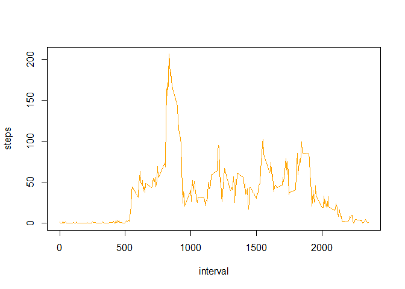
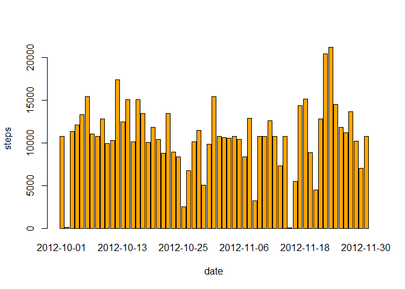
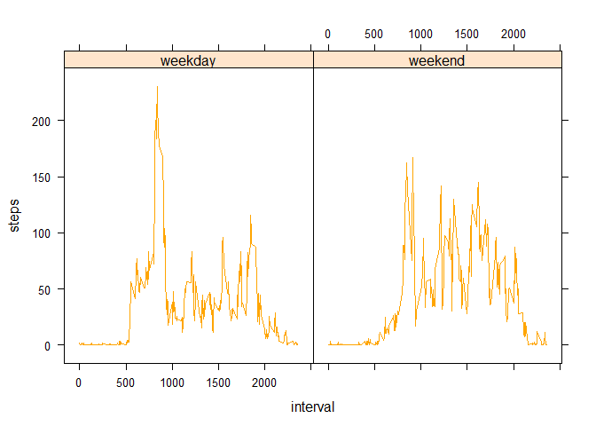

# Reproducible Research: Peer Assessment 1


## Loading and preprocessing the data


```r
unzip("activity.zip")
data <- read.csv("activity.csv")
str(data)
```

```
## 'data.frame':	17568 obs. of  3 variables:
##  $ steps   : int  NA NA NA NA NA NA NA NA NA NA ...
##  $ date    : Factor w/ 61 levels "2012-10-01","2012-10-02",..: 1 1 1 1 1 1 1 1 1 1 ...
##  $ interval: int  0 5 10 15 20 25 30 35 40 45 ...
```


```r
head(data)
```

```
##   steps       date interval
## 1    NA 2012-10-01        0
## 2    NA 2012-10-01        5
## 3    NA 2012-10-01       10
## 4    NA 2012-10-01       15
## 5    NA 2012-10-01       20
## 6    NA 2012-10-01       25
```


```r
summary(data)
```

```
##      steps                date          interval     
##  Min.   :  0.00   2012-10-01:  288   Min.   :   0.0  
##  1st Qu.:  0.00   2012-10-02:  288   1st Qu.: 588.8  
##  Median :  0.00   2012-10-03:  288   Median :1177.5  
##  Mean   : 37.38   2012-10-04:  288   Mean   :1177.5  
##  3rd Qu.: 12.00   2012-10-05:  288   3rd Qu.:1766.2  
##  Max.   :806.00   2012-10-06:  288   Max.   :2355.0  
##  NA's   :2304     (Other)   :15840
```

## What is mean total number of steps taken per day?
Histogram of the sum of steps taken each day


```r
meanStepDay <- aggregate(steps ~ date, data = data, sum, na.rm = TRUE)
```
Mean of the sum of steps taken per day

```r
mean(meanStepDay$steps)
```

```
## [1] 10766.19
```
Median of the sum of steps taken per day

```r
median(meanStepDay$steps)
```

```
## [1] 10765
```

## What is the average daily activity pattern?
Plot of the time series of the average daily steps, with in 5-minute interval.

```r
avStepInt<- aggregate(steps ~ interval, data, mean)
plot(avStepInt, type='l', col="orange")
```

 
Interval and average of the highest count of steps

```r
avStepInt[which.max(avStepInt$steps),]
```

```
##     interval    steps
## 104      835 206.1698
```

## Imputing missing values
Sum of the Na values on data

```r
sum(is.na(data))
```

```
## [1] 2304
```
Sum of the Na values on data$steps

```r
sum(is.na(data$steps))
```

```
## [1] 2304
```
Both have the same amount of NAs, which leading to the conclusion that all NAs values are from the column steps.

In order to fix the problem NA values, will be applied a method of replacement of NA values, for a value corresponding to an average of 5 minute intervals with the removal of NAs.

```r
newData <- data
nas <- is.na(newData$steps)
temp <- tapply(newData$steps, newData$interval, mean, na.rm=TRUE, simplify=TRUE)
newData$steps[nas] <- temp[as.character(newData$interval[nas])]
```
Histogram

```r
newAvgStepInt <- aggregate(steps ~ date, data = newData, FUN = sum)
barplot(newAvgStepInt$steps, names.arg = newAvgStepInt$date, xlab = "date", ylab = "steps", col="orange")
```

 
Mean

```r
mean(newAvgStepInt$steps)
```

```
## [1] 10766.19
```
Median

```r
median(newAvgStepInt$steps)
```

```
## [1] 10766.19
```

## Are there differences in activity patterns between weekdays and weekends?
Adding variable dType that is if the day is a weekday or a weekend.

```r
dType <- function(date) {
    if (weekdays(as.Date(date)) %in% c("Saturday", "Sunday")) {
        "weekend"
    } else {
        "weekday"
    }
}
newData$dType <- as.factor(sapply(newData$date, dType))
```
Plotting the averages of weekdays and weekend days

```r
library(lattice)

stepInt <- aggregate(steps ~ interval + dType, newData, mean)
xyplot(steps ~ interval | dType, data=stepInt, layout=c(2,1), type='l',col="orange")
```

 
