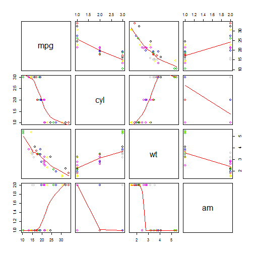

Motor Trend - Final Project Developing Data Products Course
========================================================
author: Paulo Cardoso
date: 20/04/2016
autosize: true

Introduction
========================================================
The data used in this study are from the mtcars data set and is available in the RStudio. These data were extracted from Motor Trend Magazine US in 1974. It is composed of data such as fuel consumption and 10 aspects that comprise information about design and performance of 32 car models (model 1973-74).

```r
  # loading Data set and cleaning up the data
  library(datasets)
  mtcars$cyl <- factor(mtcars$cyl)
  mtcars$am <- factor(mtcars$am,labels=c('Automatic','Manual'))
```

Exploratory Data Analyses
========================================================
Here is presented the Correlation between the variables mpg, cyl, wt and am.
 

Shiny Application and Git Hub
========================================================

The Application Shiny presents both exploratory data analysis and regression performed. This application can be found at:
- https://cardosop.shinyapps.io/SimpleShnyApplication/

The Git Hub for this entire project Shiny + Slidify is available  on:
- https://github.com/cardosop/Data-Science-Johns-Hopkins/tree/master/Developing%20Data%20Products

Results
========================================================

What can be concluded is that on the of the study to be more fuel efficient they should:
- Have 4 Cylinders
- Weight between 1000 and 2000 lb
- Have a Manual Transmission

